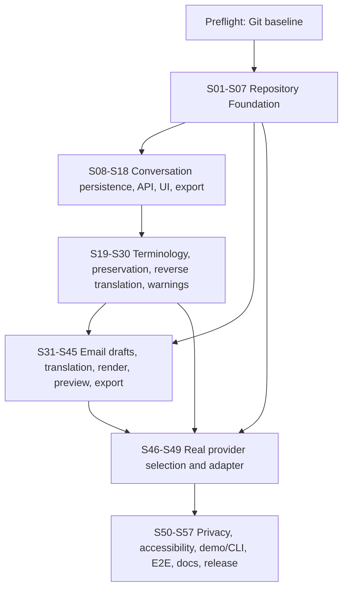

# Bridge Surface MVP Sprint Plan

Planning baseline: 2026-08-06  
Source of truth: `BRIDGE-SPEC.md` plus the attached sprint-planning guideline  
Execution model: one Codex run, one review, and one commit per sprint

## 1. Current-state assessment

- The repository contains only `BRIDGE-SPEC.md` (the product/technical specification) and an empty `docs/` directory before this planning pass.
- There are no backend or frontend source files, tests, migrations, dependency manifests, lockfiles, environment examples, development scripts, CI configuration, or existing quality-gate commands.
- No product functionality is implemented or runnable. There is no partial implementation to preserve.
- The directory is not currently a Git worktree. Consequently, uncommitted changes and prior commit history cannot be inspected, and the requested clean-review-commit workflow cannot begin until the repository owner initializes Git or places these files in the intended checkout.
- The spec is detailed enough to plan the MVP architecture, domain boundaries, key workflows, and acceptance conditions. The real translation-provider vendor and organization-approved data boundary remain undecided.
- This planning pass creates only `docs/sprint-plan.md`, `docs/architecture-decisions.md`, and `docs/risk-register.md`. It does not implement a feature sprint.

## 2. Planning assumptions and conflicts

1. **Planning instruction controls this execution.** `BRIDGE-SPEC.md` ends by directing implementation of its Phase 0. The attached guideline instead requires planning documents and says not to begin feature sprints. This execution follows the narrower, newer planning instruction.
2. **Git is a pre-sprint prerequisite.** Before Sprint 01, the repository owner must initialize or restore the intended Git worktree, add the planning baseline, and confirm `git status --short` is clean. The schedule does not guess a remote, branch policy, or license.
3. **Commands must first be created.** There is no present configuration from which to obtain “actual commands.” ADR-002 therefore establishes the commands that Sprint 01 and Sprint 06 will make real. A gate is not required before its tooling exists.
4. **Mailbox integration is post-MVP.** The product spec describes a later mail-integration preparation phase, while the planning guideline explicitly says email sending is not implemented in the MVP schedule. This plan includes approved plain-text/HTML copy and export only; it excludes SMTP, Microsoft Graph, Gmail, mailbox draft creation, delivery protocols/providers, and send endpoints.
5. **Conversation delete means archive.** The suggested API lists DELETE while the model contains `archived_at`. The MVP uses archive semantics and preserves history (ADR-014).
6. **Mixed-recipient ordering needs explicit resolution.** A recipient-first order cannot satisfy contradictory To-recipient preferences. ADR-011 defines the deterministic rule used by this plan.
7. **Email source edits are allowed but invalidate derived approval.** The spec's “original is never overwritten” rule means translation must never replace source content. Authors may revise an open draft; doing so clears translation/reverse/warnings/approvals. Approved source is locked until explicitly reopened (ADR-006).
8. **A real-provider vendor is not selected.** Sprints 01-45 remain provider-neutral. Sprint 46 requires a vendor/data-boundary decision; no vendor is assumed in advance.
9. **BCC remains model/API-capable but visually secondary.** To and CC receive the required MVP UX. BCC does not receive a prominent workflow unless later directed.

## 3. Canonical quality gates

These commands become the repository's actual gates as the foundation is built.

**Backend gates (available after Sprint 01):**

```text
uv run ruff check .
uv run ruff format --check .
uv run mypy .
uv run pytest
```

**Frontend gates (available after Sprint 06):**

```text
npm --prefix apps/web run lint
npm --prefix apps/web run typecheck
npm --prefix apps/web run test -- --run
npm --prefix apps/web run build
```

“All gates” below means all eight commands. Sprints 01-05 use backend gates only. A sprint must fix only failures caused by its in-scope changes; unrelated cleanup becomes a separately planned sprint.

## 4. Dependency map



Critical capability dependencies:

- Migration infrastructure (S02) precedes every persistent model (S03, S08, S10, S19, S27, S31, S33, S34).
- Translation contracts and mock (S04) precede message translation (S12), terminology context (S22), email translation (S38), and the real adapter (S47).
- A complete mock-backed conversation workflow (S08-S18) precedes terminology and meaning enhancements (S19-S30).
- Global terminology CRUD (S19-S21) precedes conversation/email scope resolution (S22, S37).
- Email draft persistence/API (S31-S32) precedes the composer (S35); recipients and signatures (S33-S34) precede their composer controls (S36).
- Email translation and approval (S38-S40) precede ordering/rendering (S41-S43); plain text and HTML are tested before preview/export (S44-S45).
- The provider abstraction/mock and all domain workflows precede the real provider (S46-S49), keeping vendor concerns isolated.
- External provider failure and privacy controls (S48-S50) precede the MVP release gate (S57).

## 5. Sprint execution protocol

At the beginning of every sprint, Codex must inspect the current tree and Git status, confirm the listed dependencies are committed and green, restate the sprint boundary and exclusions, identify likely files/modules, and only then implement. If prerequisites are absent or the tree contains overlapping uncommitted work, stop and report the blocker.

At the end of every sprint, Codex must report work completed, files created/modified, tests added/changed, commands and results, deviations, known limitations, and the recommended next sprint. Stop as soon as that sprint's acceptance criteria and gates pass. Never continue automatically.

---

# Phase 1 — Repository Foundation

## Sprint 01 — Boot the backend

**Objective:** Create a minimal installable Python/FastAPI application with operational health/config endpoints and enforceable backend quality commands.

**Included work:** Add Python 3.13 project metadata and lockfile; establish `src/bridge_surface` and `apps/api` packages; add settings with safe defaults; expose `GET /health` and `GET /api/v1/config`; add `.gitignore` and a minimal `.env.example`; configure Ruff, Mypy, and Pytest.

**Explicitly excluded work:** Database access, migrations, CLI, translation providers, frontend, domain models, authentication, CI hosting.

**Expected files or modules:** Root Python/tool configuration and lockfile; API application/config modules; package initializers; backend test configuration; health/config tests. Exact module filenames may be adjusted while preserving ADR-001.

**Dependencies:** Git preflight and committed planning baseline.

**Acceptance criteria:** A fresh `uv sync` succeeds; the application imports; `/health` returns a non-secret healthy response; `/api/v1/config` exposes only safe public configuration; no credentials are logged or returned.

**Tests:** Unit tests for settings defaults/redaction; FastAPI integration tests for health, config, and unknown routes.

**Quality gates:** `uv run ruff check .`; `uv run ruff format --check .`; `uv run mypy .`; `uv run pytest`.

**Stop condition:** Stop when the backend gates pass and the two endpoints are demonstrably callable; report results and do not start persistence work.

**Risk notes:** Package layout/import configuration can expand scope. Do not add Docker, deployment manifests, or an application factory beyond what tests need.

## Sprint 02 — Establish migrations and database sessions

**Objective:** Add a SQLite persistence foundation with Alembic before any persistent domain model exists.

**Included work:** Add database URL settings; create SQLAlchemy engine/session/base boundaries; initialize Alembic configuration; create an empty baseline migration; provide test database isolation and migration upgrade/downgrade helpers.

**Explicitly excluded work:** User or product tables, repositories, CRUD endpoints, seed data, PostgreSQL infrastructure.

**Expected files or modules:** Persistence/config modules; Alembic environment and version directory; migration test fixtures; migration integration tests.

**Dependencies:** Sprint 01.

**Acceptance criteria:** A new SQLite file upgrades from no schema to Alembic head and downgrades cleanly; application startup does not silently call `create_all`; tests use isolated databases.

**Tests:** Integration test for upgrade/downgrade/head detection; unit test for database URL configuration.

**Quality gates:** All four backend gates.

**Stop condition:** Stop when the empty migration lifecycle and database session smoke test pass; do not add a domain table.

**Risk notes:** Alembic import paths and async-versus-sync choices can consume the sprint. Prefer the simplest SQLAlchemy 2.x session model compatible with FastAPI and HTTPX tests.

## Sprint 03 — Persist the local owner

**Objective:** Add the single local user record and ownership resolution seam needed by later domain objects.

**Included work:** Add the User ORM/domain/API-read shape; create its migration and repository; create an idempotent local-user bootstrap service; expose current-user resolution as an application dependency without authentication.

**Explicitly excluded work:** Login, passwords, roles, organizations, user management UI/API, SSO, conversation records.

**Expected files or modules:** User model/repository/service modules; ownership dependency; one migration; unit and migration/repository tests.

**Dependencies:** Sprint 02.

**Acceptance criteria:** Bootstrap creates exactly one configured local user and is idempotent; future services can request the current owner without hard-coded IDs; browser input cannot choose the owner.

**Tests:** Repository and bootstrap unit/integration tests; migration round-trip; ownership dependency test.

**Quality gates:** All four backend gates.

**Stop condition:** Stop when local ownership resolves from a migrated empty database and all backend gates pass; do not add authentication or conversations.

**Risk notes:** Avoid premature tenant/auth abstractions. Store only fields required by the spec and future ownership.

## Sprint 04 — Define translation contracts and deterministic mock

**Objective:** Create the provider abstraction and a credential-free mock that every early workflow can depend on.

**Included work:** Define language values, translation context/result/warning/provider-metadata schemas, async provider protocol, deterministic mock behavior for Japanese↔English fixtures, and provider factory defaulting to mock.

**Explicitly excluded work:** Message/email services, terminology persistence, real HTTP calls, vendor SDKs, retries, meaning-warning storage.

**Expected files or modules:** Translation contracts/protocol/mock/factory modules; provider contract tests and fixtures.

**Dependencies:** Sprint 01.

**Acceptance criteria:** The mock supports both directions, returns stable translated/reverse text and metadata, preserves fixture identifiers/numbers, and loads with no credential; unsupported languages fail clearly.

**Tests:** Protocol conformance/type tests; mock behavior, determinism, direction, and error tests; no-network test.

**Quality gates:** All four backend gates.

**Stop condition:** Stop when the mock contract is fully testable in isolation; do not connect it to an API workflow.

**Risk notes:** A mock that merely echoes text can conceal UI direction bugs. Use small explicit bilingual fixtures plus a predictable fallback clearly marked as mock output.

## Sprint 05 — Add the operational CLI

**Objective:** Provide the minimal owner/admin CLI required to start and diagnose the foundation.

**Included work:** Add the `bridge` Typer entry point with `init-db`, `migrate`, `run-api`, and `doctor`; make doctor check Python version, DB reachability/migration head, provider selection/configuration, and report that the frontend is not yet available.

**Explicitly excluded work:** Seed demo, user-management prompts, conversation/email commands, frontend building, shell-specific scripts.

**Expected files or modules:** CLI command groups; operational service helpers; CLI tests; packaging entry-point configuration.

**Dependencies:** Sprints 02-04.

**Acceptance criteria:** Commands have useful help and exit codes; init/migrate are idempotent; doctor redacts secrets and distinguishes required failure from optional mock-provider status; run-api invokes the app without duplicating configuration.

**Tests:** Typer runner tests for help, success/failure exits, idempotent DB setup, redaction, and doctor output.

**Quality gates:** All four backend gates.

**Stop condition:** Stop when the four commands pass tests and `uv run bridge doctor` reports the current foundation accurately; do not add feature CLI commands.

**Risk notes:** Process-launch tests can be brittle. Test command wiring without leaving a server process running.

## Sprint 06 — Boot the web application

**Objective:** Create a minimal React/TypeScript/Vite application with its own enforceable lint, type, test, and production-build gates.

**Included work:** Scaffold the web package and lockfile; add accessible app shell/routing placeholders for Conversation and Email; add a typed client for health/config; display backend availability and mock/external provider status; configure ESLint, TypeScript, Vitest, and production build.

**Explicitly excluded work:** Conversation/email forms, domain state, UI framework, global store, service worker, deployment.

**Expected files or modules:** `apps/web` package/config; app shell; API client/config hook; small styling layer; frontend tests.

**Dependencies:** Sprint 01; Sprint 04 for provider status semantics.

**Acceptance criteria:** `npm ci` succeeds; dev app can show a safe connected/disconnected state; navigation placeholders are keyboard accessible; all four frontend commands exist and pass.

**Tests:** Component tests for shell/navigation/config states; API client tests for success and unavailable backend.

**Quality gates:** All eight canonical commands.

**Stop condition:** Stop when the production build and all gates pass; do not create feature forms or shared-message components.

**Risk notes:** Vite scaffolding produces many generated/config files; keep dependencies minimal and avoid styling the final product prematurely.

## Sprint 07 — Make the foundation reproducible

**Objective:** Finish a clean-checkout developer workflow and foundation documentation without starting product features.

**Included work:** Complete README setup/run/test/mock-provider instructions; document the canonical commands, repository boundaries, product principles, architecture skeleton, and roadmap; align `.env.example`; add cross-platform task aliases only if they wrap canonical commands; make doctor detect the frontend build/package state.

**Explicitly excluded work:** CI vendor pipelines, containers, deployment, demo domain data, conversations, emails, real provider configuration.

**Expected files or modules:** README; `.env.example`; `docs/architecture.md`, `docs/product-principles.md`, `docs/roadmap.md`; optional root task wrapper; doctor tests.

**Dependencies:** Sprints 01-06.

**Acceptance criteria:** A reviewer can follow the README from a clean checkout to install, migrate, start backend/frontend, and run all gates; docs state mock behavior and limitations; doctor recognizes backend, DB, provider, and frontend status.

**Tests:** Update CLI/doc-command smoke tests as needed; no documentation-only snapshot churn.

**Quality gates:** All eight canonical commands.

**Stop condition:** Stop when the documented clean-install path is accurate and all gates pass; report Foundation complete and recommend Sprint 08 only.

**Risk notes:** Do not let documentation cleanup become feature implementation or add infrastructure not requested by the spec.

---

# Phase 2 — Conversation Mode Foundation

## Sprint 08 — Persist conversations

**Objective:** Add the owned Conversation aggregate and persistence/service operations without exposing HTTP endpoints.

**Included work:** Add Conversation model and migration; repository create/list/get/update-title/archive operations; service ownership checks and UTC timestamps; optimistic concurrency for mutable title/archive changes.

**Explicitly excluded work:** API routes, messages, translation, frontend, hard deletion, search/pagination beyond a simple bounded list.

**Expected files or modules:** Conversation model/repository/service groups; migration; repository/service and migration tests.

**Dependencies:** Sprints 02-03 and Phase 1 green.

**Acceptance criteria:** The local owner can create/list/read/rename/archive conversations; archived records are excluded by default but retrievable explicitly; stale writes fail without overwriting newer state.

**Tests:** Unit tests for service rules; repository integration tests for ownership, archive filtering, concurrency, and migration round-trip.

**Quality gates:** All eight canonical commands.

**Stop condition:** Stop when conversation persistence behavior passes with no API changes; do not add messages.

**Risk notes:** Keep archive semantics explicit and avoid speculative sharing, participants, folders, or search.

## Sprint 09 — Expose conversation lifecycle APIs

**Objective:** Make conversation lifecycle operations available through typed `/api/v1` endpoints.

**Included work:** Add request/response schemas and routes for list, create, get, patch title, and archive; map not-found/conflict/domain errors; publish OpenAPI descriptions of archive behavior.

**Explicitly excluded work:** Message nesting, bulk endpoints, hard delete, frontend, authorization roles.

**Expected files or modules:** Conversation API schemas/routes/dependencies; application registration; API integration tests.

**Dependencies:** Sprint 08.

**Acceptance criteria:** Endpoints return stable typed JSON and correct status codes; caller cannot set owner/timestamps/archive fields through create; DELETE archives and does not remove the row; stale update returns a conflict.

**Tests:** HTTP integration tests for happy paths, validation, missing IDs, archive visibility, ownership, and concurrency conflict.

**Quality gates:** All eight canonical commands.

**Stop condition:** Stop when conversation lifecycle API tests and all gates pass; do not start message persistence or UI.

**Risk notes:** Avoid generic CRUD helpers that obscure field allowlists or domain errors.

## Sprint 10 — Persist immutable messages

**Objective:** Add a Message entity whose original content is immutable and whose derived translation fields have explicit states.

**Included work:** Add message/state model and migration; repository create/list/get/update-derived operations; service to create Japanese- or English-source messages within owned active conversations; enforce source/original immutability.

**Explicitly excluded work:** Provider calls, warnings table, approval transitions, API routes, frontend, editing original messages.

**Expected files or modules:** Message model/state/repository/service groups; migration; service/repository tests.

**Dependencies:** Sprint 08.

**Acceptance criteria:** Both source directions persist; ordering is deterministic; an original/source update is rejected; messages cannot be added to archived or unowned conversations; initial state is `draft`.

**Tests:** Migration round-trip; repository ordering; service tests for language/side validation, ownership, archived conversation, and immutable fields.

**Quality gates:** All eight canonical commands.

**Stop condition:** Stop when message persistence and immutability tests pass; do not call the translation provider.

**Risk notes:** Keep `speaker_side` and `source_language` distinct but validate allowed combinations so UI direction remains meaningful.

## Sprint 11 — Expose message create and history APIs

**Objective:** Let clients add an original message and retrieve conversation history without translation.

**Included work:** Add create/list message schemas and nested conversation routes; include all current translation-status fields in responses without exposing unrestricted provider metadata; map ownership/archive errors.

**Explicitly excluded work:** Translation endpoint, PATCH edits, approval/flagging, pagination UI, frontend compose.

**Expected files or modules:** Message API schemas/routes; conversation detail response integration if needed; HTTP tests.

**Dependencies:** Sprints 09-10.

**Acceptance criteria:** Japanese- and English-source messages can be created and listed in stable order; originals round-trip exactly; requests cannot prefill translation/provider/state fields; archived conversations reject new messages.

**Tests:** HTTP integration tests for both sides, Unicode preservation, field rejection, ordering, missing/archived conversation, and ownership.

**Quality gates:** All eight canonical commands.

**Stop condition:** Stop when original-only message API flow is green; do not translate or build UI.

**Risk notes:** Request/response schema separation is essential to prevent mass assignment.

## Sprint 12 — Translate messages with the mock provider

**Objective:** Complete the first backend conversation translation workflow using the deterministic mock.

**Included work:** Add message translation application service and endpoint; build context from the conversation and safe defaults; persist validated result, reverse text, preserved terms, sanitized metadata, and `translated` state transactionally; expose retry-safe behavior.

**Explicitly excluded work:** Terminology database, meaning-warning records, real provider, edit/approval, frontend.

**Expected files or modules:** Message translation service; provider dependency/factory wiring; translation route/schema; integration tests.

**Dependencies:** Sprints 04 and 11.

**Acceptance criteria:** A draft message translates in the opposite direction; original remains byte-for-byte unchanged; repeated translate has defined idempotent/replace behavior; provider failure leaves the saved message in its prior valid state.

**Tests:** Service and HTTP integration tests for both directions, metadata sanitization, unchanged original, repeat call, invalid state, and injected provider failure rollback.

**Quality gates:** All eight canonical commands.

**Stop condition:** Stop when the mock-backed backend flow passes; do not add terminology, real-provider behavior, or UI.

**Risk notes:** Keep database transaction boundaries outside the provider call where needed so a timeout does not lock or erase the saved original.

## Sprint 13 — Build the conversation workspace shell

**Objective:** Give users a usable conversation list/create/select workspace backed by the API.

**Included work:** Add typed conversation client/hooks; list and create controls; selected-conversation header/rename/archive interactions; empty/loading/error states; preserve the three-region desktop shell without message composition yet.

**Explicitly excluded work:** Message rows, compose controls, translation review, mobile polish, search.

**Expected files or modules:** Conversation feature components/hooks/API types/styles; route integration; component tests.

**Dependencies:** Sprint 09 and Sprint 06.

**Acceptance criteria:** User can create, select, rename, and archive a conversation; refresh reloads server state; errors are visible and do not discard the current selection; layout labels Japanese, Shared Meaning, and English regions.

**Tests:** Frontend tests for list/create/select/rename/archive, loading/empty/error states, and refresh fetch behavior.

**Quality gates:** All eight canonical commands.

**Stop condition:** Stop when conversation lifecycle UI passes; do not add message composition or translation controls.

**Risk notes:** Avoid introducing a global store; feature-local state and focused hooks are sufficient.

## Sprint 14 — Compose shared bilingual message rows

**Objective:** Let either side add a message and render it as one shared bilingual row connected to its translation.

**Included work:** Add Japanese-side and English-side compose controls; create then translate via existing APIs; add shared-row component showing speaker, direction, original, translation, status, and timestamp; provide clear pending/error/retry states.

**Explicitly excluded work:** Editing translations, approval, warnings, reverse display, terminology, mobile stacking polish.

**Expected files or modules:** Message API hook/types; side composers; shared message row; conversation workspace styles/tests.

**Dependencies:** Sprints 12-13.

**Acceptance criteria:** Japanese and English inputs create distinct correctly directed rows; each row is a single shared object, not alternating chat bubbles; original remains visible during translation failure; retry does not duplicate the original.

**Tests:** Frontend flow tests for both source sides, pending/success/failure/retry, direction labels, and no duplicate message on retry.

**Quality gates:** All eight canonical commands.

**Stop condition:** Stop when mock-backed compose/display works in both directions and gates pass; do not add review controls.

**Risk notes:** Create-plus-translate is a two-request workflow. UI identifiers and retry handling must not accidentally create a second original.

## Sprint 15 — Enforce translation edit and approval states

**Objective:** Add backend rules for editing a translated message and explicitly approving it.

**Included work:** Add translation-edit and approve service operations/endpoints; implement allowed state transitions among `translated`, `edited`, and `approved`; preserve provider output history only to the extent required for current metadata/timestamps; prohibit edits of original fields.

**Explicitly excluded work:** Warning acknowledgement, meaning validation, frontend controls, approval audit history, retranslation UX.

**Expected files or modules:** Message state-transition/service logic; PATCH/approve schemas/routes; unit and HTTP tests.

**Dependencies:** Sprint 12.

**Acceptance criteria:** Translation text can be edited independently; edit changes state and update time; approval requires nonempty translation; approved content cannot change without explicit transition supported by the service; direct original edits fail.

**Tests:** State transition table unit tests; API tests for edit/approve happy paths and illegal/missing/stale/immutable updates.

**Quality gates:** All eight canonical commands.

**Stop condition:** Stop when backend edit/approval rules pass; do not add warnings or frontend review.

**Risk notes:** Do not create an overly generic state machine; encode only transitions required by the current workflow.

## Sprint 16 — Review, edit, approve, and copy translations

**Objective:** Complete the core desktop Conversation Mode review workflow.

**Included work:** Add row controls to review/edit/cancel/save translation, approve, and copy either language; display translation state and immutable original; handle optimistic conflicts and API errors without losing typed edits.

**Explicitly excluded work:** Reverse translation display, warning acknowledgement, terminology, export transcript, mobile redesign.

**Expected files or modules:** Shared-row review/editor components; clipboard helper; message API hook updates; frontend tests/styles.

**Dependencies:** Sprints 14-15.

**Acceptance criteria:** User can edit only the translation, approve it, and copy either version; approved state is visible; original cannot be edited; failed save retains local edit; stale save shows a conflict and reload option.

**Tests:** Frontend tests for edit/cancel/save/approve, copy both languages, immutable original, server error, and optimistic conflict.

**Quality gates:** All eight canonical commands.

**Stop condition:** Stop when the main conversation review workflow is green; do not add terminology or meaning features.

**Risk notes:** Clipboard APIs vary; isolate them and make failure visible without blocking review.

## Sprint 17 — Preserve history across desktop and mobile

**Objective:** Make the complete mock-backed conversation workflow responsive and reliable after reload.

**Included work:** Load message history when selecting/reloading a conversation; implement desktop three-region alignment and mobile stacked cards that preserve original/translation/speaker/direction relationships; add accessible focus/label behavior for the current controls.

**Explicitly excluded work:** New backend features, virtualized long histories, offline mode, visual branding, terminology/warnings.

**Expected files or modules:** Conversation/message loading hooks; workspace/message responsive styles; component/integration tests.

**Dependencies:** Sprint 16.

**Acceptance criteria:** Created/translated/edited/approved messages survive refresh; both source directions remain visually understandable at desktop and narrow widths; controls are labeled and keyboard reachable; no language view is hidden.

**Tests:** Frontend reload/history tests, responsive structural assertions, direction/state rendering, and keyboard interaction tests.

**Quality gates:** All eight canonical commands.

**Stop condition:** Stop when persistence/reload and responsive acceptance criteria pass; do not start terminology enhancements.

**Risk notes:** DOM tests cannot prove visual quality alone; include a manual viewport checklist in the sprint report without adding a screenshot toolchain.

## Sprint 18 — Export bilingual conversation transcripts

**Objective:** Export a saved conversation as a clear bilingual transcript and expose it through API, CLI, and a small UI action.

**Included work:** Add a pure transcript formatter/service; API export endpoint with stable media type/filename; implement `bridge export-conversation`; add conversation export/download or copy action; include speaker, time, source direction, original, and translation without provider secrets.

**Explicitly excluded work:** PDF/DOCX, email conversion, bulk export, direct sharing, terminology report, mailbox integration.

**Expected files or modules:** Transcript/export service; API route; CLI command; one frontend export control/API method; unit/integration/frontend tests.

**Dependencies:** Sprint 17 and Sprint 05.

**Acceptance criteria:** Export preserves message order and Unicode, includes both language views and state, omits sensitive provider metadata, and works from API/CLI/UI for an owned conversation; archived conversation behavior is documented and tested.

**Tests:** Formatter unit tests; API/CLI integration tests; frontend export success/error test.

**Quality gates:** All eight canonical commands.

**Stop condition:** Stop when export is reviewable and all gates pass; report Conversation Mode Foundation complete and recommend Sprint 19.

**Risk notes:** Keep the initial format plain text or Markdown. Do not introduce document-generation dependencies.

---

# Phase 3 — Terminology and Meaning Validation

## Sprint 19 — Persist global terminology

**Objective:** Add the TerminologyEntry model and global-scope repository/service foundation.

**Included work:** Add terminology model, scope/status fields, migration, repository, and validation for source/preferred-language terms, do-not-translate, notes, active state, and duplicate-active rejection.

**Explicitly excluded work:** HTTP API, frontend, conversation/email scopes, translation-context injection, organization/user scopes.

**Expected files or modules:** Terminology model/repository/service groups; migration; repository/service tests.

**Dependencies:** Sprint 02 and completed Phase 2.

**Acceptance criteria:** Global entries can be created, updated, deactivated, listed, and validated; duplicate active source terms at global scope are rejected; deletion semantics preserve prior translation references where applicable.

**Tests:** Migration round-trip; repository/service CRUD, Unicode, duplicate, active/inactive, and do-not-translate tests.

**Quality gates:** All eight canonical commands.

**Stop condition:** Stop when global terminology persists correctly; do not expose it or affect translation.

**Risk notes:** Normalize for matching carefully without altering stored Japanese text; defer fuzzy matching.

## Sprint 20 — Expose terminology CRUD APIs

**Objective:** Provide typed, owner-safe CRUD endpoints for global terminology.

**Included work:** Add list/create/patch/deactivate API schemas/routes; filtering by active/scope as needed; stable validation/conflict errors; do not expose future organization/user scope creation.

**Explicitly excluded work:** Frontend, conversation/email scope binding, import/export, provider context changes.

**Expected files or modules:** Terminology API schemas/routes; dependency registration; HTTP integration tests.

**Dependencies:** Sprint 19.

**Acceptance criteria:** API supports valid global lifecycle operations; invalid language/empty entry/duplicate returns clear errors; arbitrary scope IDs or ownership cannot be injected.

**Tests:** HTTP CRUD, filter, duplicate, validation, deactivation, not-found, and forbidden-field tests.

**Quality gates:** All eight canonical commands.

**Stop condition:** Stop when the global terminology contract passes; do not build UI or translation injection.

**Risk notes:** Keep API payloads explicit; avoid a polymorphic scope API that enables unimplemented scopes.

## Sprint 21 — Manage global terminology in the UI

**Objective:** Let the local user view, add, edit, and deactivate global terminology.

**Included work:** Add terminology screen/table/form; support Japanese/English preferred terms, do-not-translate, notes, and active status; display validation/conflict errors accessibly.

**Explicitly excluded work:** Bulk import, organization/user scopes, conversation inline terms, provider prompt behavior.

**Expected files or modules:** Terminology feature components/hooks/API types/styles and frontend tests.

**Dependencies:** Sprint 20.

**Acceptance criteria:** User can complete global CRUD from the browser; Japanese text is preserved; duplicate conflicts are understandable; deactivated entries are distinguishable and filterable.

**Tests:** Frontend CRUD flows, validation, duplicate error, do-not-translate, deactivate/filter, and API failure.

**Quality gates:** All eight canonical commands.

**Stop condition:** Stop when global terminology UI is green; do not alter translation output.

**Risk notes:** Avoid a generic data-grid dependency for a modest list.

## Sprint 22 — Apply conversation terminology context

**Objective:** Resolve global and conversation-scoped terms deterministically and inject them into mock-backed message translation.

**Included work:** Enable conversation-scoped entries in service/API; implement most-specific precedence and duplicate checks; build translation context from effective terms; persist/report which terms were applied.

**Explicitly excluded work:** Conversation terminology UI, email-draft scope, automatic extraction, add-from-warning, real provider prompts.

**Expected files or modules:** Scope-aware terminology service/repository/API updates; message translation context integration; unit/integration tests; migration only if the earlier schema cannot represent scope safely.

**Dependencies:** Sprints 12 and 20.

**Acceptance criteria:** Conversation term overrides global term only in that conversation; do-not-translate is honored by the mock contract; inactive/unrelated terms are excluded; effective preserved terms are returned with the message.

**Tests:** Precedence/collision/scope isolation unit tests; message translation integration tests for global, conversation, do-not-translate, inactive, and unchanged original.

**Quality gates:** All eight canonical commands.

**Stop condition:** Stop when API-created conversation terms deterministically affect message context; do not add UI or email scope.

**Risk notes:** Context size and matching rules can expand rapidly. Use exact normalized term matching only for MVP.

## Sprint 23 — Manage terminology inside a conversation

**Objective:** Add a conversation terminology panel and make its effects visible in shared message rows.

**Included work:** Add list/create/edit/deactivate controls scoped to selected conversation; display global-versus-conversation scope and preserved terms on translated rows; refresh terms without losing conversation state.

**Explicitly excluded work:** Warning-driven term creation, email scope, bulk import, automatic suggestions.

**Expected files or modules:** Conversation terminology components/hooks; shared-row preserved-term display; frontend tests/styles.

**Dependencies:** Sprints 21-22.

**Acceptance criteria:** User can manage conversation-specific terms without changing global entries; row displays effective preserved terms; translations in another conversation are unaffected; scope is never ambiguous in UI.

**Tests:** Frontend conversation-term CRUD, scope label, override visibility, deactivation, and cross-conversation isolation mocks.

**Quality gates:** All eight canonical commands.

**Stop condition:** Stop when conversation terminology UX passes; do not add warning shortcuts.

**Risk notes:** Keep terminology panel secondary to the shared surface and keyboard accessible; avoid modal proliferation.

## Sprint 24 — Guard numbers and technical identifiers

**Objective:** Detect changes to numerical values and manufacturing identifiers independently of provider claims.

**Included work:** Add deterministic extraction/comparison for numbers, units, dates/times, currency, equipment/work-order/drawing-like codes, and exact do-not-translate terms; emit structured preservation findings without rewriting provider output.

**Explicitly excluded work:** General NLP similarity, Japanese grammar analysis, warning persistence/UI, real-provider tuning.

**Expected files or modules:** Preservation validator/extractor modules; translation service integration; focused fixtures/tests.

**Dependencies:** Sprint 22.

**Acceptance criteria:** Representative values such as `Line 4`, `Robot 17`, `EQ-1048`, `WO123456`, `Drawing 22A-118`, `0.05 mm`, times, and currency are unchanged or flagged; false positives for ordinary bilingual words remain bounded; originals never change.

**Tests:** Table-driven unit tests for preservation/pass/fail cases and Unicode punctuation; message translation integration test converting mismatches to structured findings.

**Quality gates:** All eight canonical commands.

**Stop condition:** Stop when the specified identifier/value corpus is covered; do not implement broad semantic validation.

**Risk notes:** Regex scope can balloon and locale formats vary. Document supported patterns and surface uncertainty rather than guessing.

## Sprint 25 — Generate reverse translations on demand

**Objective:** Add an explicit reverse-translation backend operation for existing message translations.

**Included work:** Add reverse-translation service and endpoint using current edited translation as input; retain original separately; store validated reverse text/status/timestamp; define re-run and invalidation behavior after translation edits.

**Explicitly excluded work:** Meaning comparison/warnings, frontend display, email reverse translation, real provider.

**Expected files or modules:** Reverse translation service; message route/schema updates; state rules and integration tests.

**Dependencies:** Sprints 15 and 22.

**Acceptance criteria:** A translated or edited message can generate reverse text in the source language; editing translation invalidates older reverse text; original remains unchanged; provider failure preserves prior saved content.

**Tests:** State/invalidation unit tests; API integration tests for both directions, edited input, repeat, invalid state, and failure rollback.

**Quality gates:** All eight canonical commands.

**Stop condition:** Stop when reverse translation backend behavior is stable; do not create warnings or UI.

**Risk notes:** The mock must make direction/input choice observable so tests catch translating the original twice.

## Sprint 26 — Review reverse translations

**Objective:** Display and refresh reverse translation as a validation artifact in Conversation Mode.

**Included work:** Add show/hide/generate/refresh controls; compare original and reverse without treating reverse as a third first-class message; make invalidation and provider errors visible.

**Explicitly excluded work:** Automated meaning warnings, email reverse review, side-by-side diff algorithms, approval acknowledgement.

**Expected files or modules:** Shared-row reverse-validation component; message API hook updates; styles/frontend tests.

**Dependencies:** Sprint 25.

**Acceptance criteria:** User can generate and inspect reverse text next to the original; edit invalidation is clear; reverse text is labeled validation-only; it is absent from conversation transcript export unless explicitly specified as validation metadata (default: absent).

**Tests:** Frontend generate/show/hide/refresh/error/invalidation tests and transcript negative assertion.

**Quality gates:** All eight canonical commands.

**Stop condition:** Stop when reverse-review UX passes; do not implement meaning analysis.

**Risk notes:** Do not visually elevate reverse text to equal status with the two shared language versions.

## Sprint 27 — Persist structured meaning warnings

**Objective:** Parse provider-generated validation feedback and store normalized MessageWarning records.

**Included work:** Add MessageWarning model/migration/repository; structured warning parser for required categories/severity; validation service comparing original/translation/reverse plus preservation findings; safe handling of malformed provider feedback.

**Explicitly excluded work:** Warning endpoints/UI, approval acknowledgement, term creation, provider-specific prompt tuning.

**Expected files or modules:** Warning model/repository/parser/validation service; migration; parser/repository/service tests.

**Dependencies:** Sprints 24-25 and Sprint 02.

**Acceptance criteria:** Supported warning types normalize and persist; unknown/malformed feedback cannot crash or overwrite translations; preservation mismatches become warnings; revalidation has defined replace/resolution behavior.

**Tests:** Meaning-warning parsing unit tests for every required category, partial/malformed/unknown data, severity; migration/repository and revalidation tests.

**Quality gates:** All eight canonical commands.

**Stop condition:** Stop when warnings can be generated and stored by services; do not expose or acknowledge them.

**Risk notes:** Provider feedback is advisory. Do not invent confidence thresholds or claim semantic equivalence.

## Sprint 28 — Enforce warning review and approval acknowledgement

**Objective:** Expose warnings and require explicit acknowledgement before approving a message with unresolved warnings.

**Included work:** Add validate, list warnings, resolve/reopen, and approve-with-acknowledgement API behavior; implement `warning`/`review_needed` transitions; retain user choice to approve despite warnings.

**Explicitly excluded work:** Frontend, add-term shortcut, automatic blocking based on severity, audit/compliance certification.

**Expected files or modules:** Warning/message service state rules; validation/warning routes and schemas; integration tests.

**Dependencies:** Sprints 15 and 27.

**Acceptance criteria:** Unresolved warnings are visible through API; approval without explicit acknowledgement fails; acknowledged approval succeeds without deleting warnings; resolved and reopened states behave consistently; no warning silently changes text.

**Tests:** State-transition unit tests; API tests for validate, warning list, resolve/reopen, approve rejected/accepted, stale state, and no-warning flow.

**Quality gates:** All eight canonical commands.

**Stop condition:** Stop when backend warning/approval rules pass; do not build the warning UI.

**Risk notes:** Keep “resolved” and “acknowledged for this approval” semantically distinct in schemas and tests.

## Sprint 29 — Review and acknowledge meaning warnings

**Objective:** Complete the visible Conversation Mode meaning-validation workflow.

**Included work:** Add warning list with type/severity/message, validate action, resolve/reopen controls, and explicit acknowledgement in approval; show preservation and ambiguity warnings without hiding either language.

**Explicitly excluded work:** Add-to-terminology shortcut, automatic fixes, severity-based approval prohibition, dashboard analytics.

**Expected files or modules:** Warning review components/hooks; approval control updates; shared-row styles/tests.

**Dependencies:** Sprints 26 and 28.

**Acceptance criteria:** User can generate, inspect, resolve/reopen, and explicitly acknowledge warnings; approval with warnings is deliberate; UI never edits text as a side effect; states persist after refresh.

**Tests:** Frontend validation flow, warning rendering, resolve/reopen, rejected approval, acknowledged approval, refresh, and API failure tests.

**Quality gates:** All eight canonical commands.

**Stop condition:** Stop when warning review/approval passes; do not add term creation from warnings.

**Risk notes:** Use text/icons in addition to color for severity and state.

## Sprint 30 — Promote an ambiguous term from a warning

**Objective:** Let a user create a conversation terminology entry directly from a relevant warning.

**Included work:** Add safe prefilled add-term action for ambiguous-term warnings; require user review of source/Japanese/English/do-not-translate/notes; create at conversation scope; refresh effective terminology and leave the warning record intact.

**Explicitly excluded work:** Automatic term creation, global promotion, bulk suggestions, automatic retranslation/approval.

**Expected files or modules:** Warning-to-term service/schema if needed; warning and terminology UI integration; unit/integration/frontend tests.

**Dependencies:** Sprints 23 and 29.

**Acceptance criteria:** Eligible warning can open a reviewed term form and create a conversation entry; duplicates produce a clear conflict; warning is not silently resolved; user may separately retranslate/revalidate.

**Tests:** Backend validation/duplicate tests if a dedicated endpoint is added; frontend eligible/ineligible warning, prefill/edit/create/cancel/conflict tests.

**Quality gates:** All eight canonical commands.

**Stop condition:** Stop when warning-to-term workflow passes; report Terminology and Meaning Validation complete and recommend Sprint 31.

**Risk notes:** Keep the action user-driven. A provider-suggested term is untrusted input, not an approved glossary entry.

---

# Phase 4 — Email Mode

## Sprint 31 — Persist email drafts

**Objective:** Add the owned EmailDraft aggregate and source-edit invalidation rules before any composer exists.

**Included work:** Add email draft/state/language-order model and migration; repository and service create/list/get/update/archive operations; source subject/body/language editing; timestamps, optimistic concurrency, and invalidation of derived translation/reverse/warnings/approvals after source edits.

**Explicitly excluded work:** HTTP routes, recipients, signatures, translation calls, terminology scope, rendering, frontend, delivery.

**Expected files or modules:** Email draft model/repository/service/state groups; migration; repository/service tests.

**Dependencies:** Sprint 02 and completed Phase 3.

**Acceptance criteria:** Drafts save in either source language; source edits never populate/overwrite translated fields; edits invalidate derived approval state; approved source is locked until explicit reopen; stale writes do not overwrite newer data.

**Tests:** Migration round-trip; service tests for create/update/reopen, both languages, blank-subject intent, invalidation, lock, archive, ownership, and concurrency.

**Quality gates:** All eight canonical commands.

**Stop condition:** Stop when draft persistence/state invariants pass; do not add API routes or composer UI.

**Risk notes:** Distinguish intentionally blank subject from missing/unreviewed subject without adding a general revision-history system.

## Sprint 32 — Expose email draft lifecycle APIs

**Objective:** Make owned email drafts persistable and reloadable through typed APIs.

**Included work:** Add list/create/get/patch/archive/reopen schemas and `/api/v1/email-drafts` routes; map conflict/state errors; ensure response includes review readiness without leaking internal metadata.

**Explicitly excluded work:** Recipients, signatures, translation/validate/approve routes, rendering/preview/export, frontend.

**Expected files or modules:** Email draft API schemas/routes/dependencies; HTTP integration tests.

**Dependencies:** Sprint 31.

**Acceptance criteria:** Both source languages and supported order choices round-trip; source edit invalidation is visible; archive is non-destructive; ownership/timestamps/derived fields cannot be mass-assigned; stale PATCH returns conflict.

**Tests:** HTTP CRUD, Unicode, blank-subject intent, invalidation/reopen, archive, validation, forbidden fields, ownership, and concurrency.

**Quality gates:** All eight canonical commands.

**Stop condition:** Stop when draft API lifecycle is green; do not add recipients or UI.

**Risk notes:** Keep PATCH fields allowlisted and state transitions service-owned.

## Sprint 33 — Persist mixed-language recipients

**Objective:** Add To/CC recipient persistence and API behavior, including mixed preferred languages.

**Included work:** Add EmailRecipient model/migration/repository/service; nested list/add/update/remove API; validate recipient type, address, display name, and optional preferred language; support BCC in data/API while keeping it secondary.

**Explicitly excluded work:** Contacts/address book, directory lookup, recipient UI, delivery, automatic order resolution.

**Expected files or modules:** Recipient model/repository/service and API schemas/routes; migration; unit/integration tests.

**Dependencies:** Sprint 32.

**Acceptance criteria:** One draft can contain Japanese- and English-preferring recipients across To and CC; duplicates and invalid addresses follow a documented rule; recipient changes persist without altering source/translation content; ownership is enforced.

**Tests:** Migration; service/API CRUD for To/CC/BCC, mixed preferences, duplicates, invalid input, missing draft, ownership, and ordering.

**Quality gates:** All eight canonical commands.

**Stop condition:** Stop when recipient API behavior passes; do not implement order policy or UI.

**Risk notes:** Email address validation should be practical rather than pretending to verify deliverability. Do not add contact-provider integrations.

## Sprint 34 — Persist signature profiles

**Objective:** Add reusable signature profiles and deterministic selection data for later assembly.

**Included work:** Add SignatureProfile model/migration/repository/service and CRUD API; support English, Japanese, bilingual, internal, and external/supplier profile types/content; active status; validate that selected content exists for the profile type.

**Explicitly excluded work:** Signature UI, HTML templates, automatic internal/external classification, delivery, organization/user profile scopes.

**Expected files or modules:** Signature model/repository/service and API groups; migration; service/API tests.

**Dependencies:** Sprint 02 and Sprint 32 for draft selection validation seam.

**Acceptance criteria:** Active profiles can be managed and selected on an open draft; inactive/invalid profiles cannot make a draft export-ready; content round-trips as text without execution or rendering.

**Tests:** Migration, CRUD, profile-type/content validation, deactivate-selected behavior, ownership if applicable, and draft selection tests.

**Quality gates:** All eight canonical commands.

**Stop condition:** Stop when signature/profile API behavior passes; do not render or build UI.

**Risk notes:** “Internal/external” is a selectable profile category, not inferred from email domains in the MVP.

## Sprint 35 — Build and save the email composer

**Objective:** Let a user create, edit, save, reopen, and archive source-language email drafts.

**Included work:** Add email draft list and composer; source-language selector; subject/body and intentional-blank-subject control; explicit save with dirty/saving/error/conflict states; reload/reopen behavior that reflects backend invalidation.

**Explicitly excluded work:** Recipient/signature controls, translation, reverse validation, preview, auto-save, rich-text editing.

**Expected files or modules:** Email feature route; draft API hooks/types; list/composer components/styles/tests.

**Dependencies:** Sprints 32 and 06.

**Acceptance criteria:** User can compose in Japanese or English, save, leave, and reopen exact Unicode source content; source-language change follows safe reset rules; stale save does not silently overwrite; archived drafts leave the active list.

**Tests:** Frontend create/edit/save/reload/archive, both languages, blank-subject intent, dirty state, error/conflict, and source-language reset tests.

**Quality gates:** All eight canonical commands.

**Stop condition:** Stop when source draft persistence works in the browser; do not add translation or recipients.

**Risk notes:** Keep source input plain text for MVP. Rich text would multiply sanitization and translation concerns.

## Sprint 36 — Edit recipients, order, and signature selection

**Objective:** Complete the non-translation composer inputs needed for a bilingual email.

**Included work:** Add To/CC editors with display name/address/preference; secondary BCC access; language-order selector for Japanese first, English first, sender first, and recipient first; signature profile selector and basic management link/panel; show unresolved recipient-first state.

**Explicitly excluded work:** Translation, final order assembly, signature rendering, contact lookup, auto-detection from address/domain.

**Expected files or modules:** Recipient editor; order and signature controls; signature API hooks/components; composer tests/styles.

**Dependencies:** Sprints 33-35.

**Acceptance criteria:** Mixed Japanese/English To and CC recipients persist; signature selection persists; all order choices save; mixed/unknown To preferences visibly require later explicit resolution; no email can be sent.

**Tests:** Frontend recipient CRUD/mixed preferences/validation, CC/BCC behavior, order selection/resolution prompt, signature selection/inactive state, save/reload, and API errors.

**Quality gates:** All eight canonical commands.

**Stop condition:** Stop when composer metadata controls pass; do not translate or preview.

**Risk notes:** Recipient-first ambiguity must be visible now even though final backend order enforcement arrives in Sprint 41.

## Sprint 37 — Apply email-draft terminology

**Objective:** Add email-scoped terminology and feed its effective terms into future email translation context.

**Included work:** Enable email-draft scope in terminology services/API; implement email-over-global precedence and duplicate rules; add a small draft terminology panel; expose effective terms for translation.

**Explicitly excluded work:** Organization/user scopes, automatic extraction, warning-to-term shortcut for email, actual translation calls.

**Expected files or modules:** Terminology scope resolver/API updates; email context builder; composer terminology components/hooks; tests.

**Dependencies:** Sprints 20-22 and Sprint 35.

**Acceptance criteria:** Email term overrides global only for that draft; inactive/unrelated terms are excluded; do-not-translate behavior is represented in context; user can manage scope without altering source body.

**Tests:** Backend precedence/isolation/duplicate/context tests; frontend email-term CRUD/scope/reload/error tests.

**Quality gates:** All eight canonical commands.

**Stop condition:** Stop when effective email terminology is persisted and visible; do not call a provider.

**Risk notes:** Do not reuse conversation IDs as generic scope IDs without validating scope type and owning aggregate.

## Sprint 38 — Translate email subject and body safely

**Objective:** Generate the opposite-language subject/body and reverse body through the provider-neutral service while preserving the saved draft on failure.

**Included work:** Add email translation application service; translate subject when present and body from the original; generate reverse body for validation; include email/global terminology; run preservation checks; persist derived output/warnings only after validated success; define retranslate/invalidation behavior.

**Explicitly excluded work:** HTTP routes, approval transitions, frontend, ordering/rendering, real provider, delivery.

**Expected files or modules:** Email translation/context service; draft state updates; preservation/warning integration; service tests.

**Dependencies:** Sprints 04, 27, 31, and 37.

**Acceptance criteria:** Japanese- and English-authored drafts produce the opposite language plus reverse validation; original subject/body remain unchanged; a provider failure preserves the full draft/recipients/signature/prior valid data; provider metadata is sanitized.

**Tests:** Service tests for both directions, blank subject, terminology, identifiers/numbers, retranslate, source-edit invalidation, malformed/failing provider, and transactional rollback.

**Quality gates:** All eight canonical commands.

**Stop condition:** Stop when the service is robust under success and failure; do not expose it or approve drafts.

**Risk notes:** Subject and body failures need an all-or-clearly-partial policy. Prefer atomic replacement of the derived translation set to avoid mismatched versions.

## Sprint 39 — Expose email translation and approval rules

**Objective:** Provide translate, validate, edit-translation, approve, and readiness APIs with service-enforced state rules.

**Included work:** Add draft translate/validate endpoints; translated subject/body edit endpoint; warning list/resolve behavior; separate original and translation approval flags/actions; require warning review and valid signature/order before export-ready; explicit reopen invalidates readiness.

**Explicitly excluded work:** Frontend, render/preview/export, real provider, direct send.

**Expected files or modules:** Email workflow services/state transitions; API schemas/routes; unit/integration tests.

**Dependencies:** Sprints 34 and 38; conversation warning semantics from Sprint 28.

**Acceptance criteria:** Original and translation approvals are distinct and both required; warnings require review/acknowledgement; translation edits do not alter source; unresolved recipient-first order and invalid signature block readiness; no API action sends mail.

**Tests:** Transition table; HTTP flow for both languages, edit, warning review, approvals in either order, invalidation/reopen, missing signature/order/source/translation, stale update, and absence of send route.

**Quality gates:** All eight canonical commands.

**Stop condition:** Stop when backend email review/readiness rules pass; do not render or build review UI.

**Risk notes:** Avoid one coarse `approved` boolean; tests must prove both language versions are explicitly approved.

## Sprint 40 — Review and approve both email versions

**Objective:** Add the composer review surface for opposite-language text, reverse validation, warnings, edits, and two-version approval.

**Included work:** Add translate/retry controls; show original, generated opposite language, and clearly secondary reverse validation; edit translated subject/body; review warnings; explicit original and translation approvals; show readiness blockers.

**Explicitly excluded work:** Final preview/export/copy, renderer styling, real provider UI disclosure beyond current mock label, sending.

**Expected files or modules:** Email translation/review components; draft workflow hooks/types; warning/approval UI; frontend tests/styles.

**Dependencies:** Sprints 36-39.

**Acceptance criteria:** Author can start in either language, generate opposite language/reverse, edit only generated text, review warnings, approve both language versions, and see why a draft is not ready; original is never replaced; reverse is labeled validation-only.

**Tests:** Frontend both-source flows, translate failure/retry, edit, warning acknowledgement, two approvals, invalidation after source change, signature/order blockers, and reload.

**Quality gates:** All eight canonical commands.

**Stop condition:** Stop when email review/approval UX is green; do not create preview or export.

**Risk notes:** Prevent UI state from presenting stale translation/reverse content after a source edit.

## Sprint 41 — Resolve bilingual language order and subject

**Objective:** Build a pure, deterministic assembly policy for two approved language sections and the bilingual subject.

**Included work:** Resolve Japanese-first, English-first, sender-first, and recipient-first per ADR-011; require explicit resolution for mixed/unknown To preferences; create configurable bilingual subject ordering/separator; construct an assembly DTO containing approved Japanese and English content plus one signature reference.

**Explicitly excluded work:** Plain-text/HTML formatting, UI preview, clipboard/export, delivery.

**Expected files or modules:** Email assembly/order/subject domain modules; readiness integration; unit tests.

**Dependencies:** Sprint 39.

**Acceptance criteria:** Every supported order is deterministic; mixed/unknown recipient-first fails with an actionable validation result; both languages are always included; reverse translation cannot enter the assembly DTO; subject/body use the same resolved order unless explicitly documented otherwise.

**Tests:** Table-driven tests for all order/source/preference combinations, mixed To/CC, blank subject, bilingual separator, single signature reference, and reverse-text exclusion.

**Quality gates:** All eight canonical commands.

**Stop condition:** Stop when assembly-policy tests pass; do not format plain text or HTML.

**Risk notes:** CC preferences must not accidentally determine order. Make the decision input/output explicit and pure.

## Sprint 42 — Render approved plain-text email

**Objective:** Produce canonical plain-text bilingual email output from the validated assembly model.

**Included work:** Add configurable bilingual notice, Japanese/English labeled separators, resolved subject/body order, newline normalization, and exactly one selected shared signature; support disabling the notice.

**Explicitly excluded work:** HTML, preview endpoints/UI, clipboard/download, mailbox delivery, reverse translation output.

**Expected files or modules:** Plain-text renderer/config; renderer unit tests and fixtures.

**Dependencies:** Sprint 41 and signature data from Sprint 34.

**Acceptance criteria:** Output contains both approved languages in the selected order, optional notice, and signature exactly once; original approved content is preserved except documented line-ending normalization; reverse text and provider metadata are absent.

**Tests:** Required unit tests for every order, both source languages, notice on/off, signature types/once, blank subject, Japanese Unicode, separators, and negative reverse/metadata assertions.

**Quality gates:** All eight canonical commands.

**Stop condition:** Stop when plain-text renderer tests pass; do not implement HTML or expose output.

**Risk notes:** Avoid whitespace transformations that change meaningful source formatting; define normalization narrowly.

## Sprint 43 — Render approved HTML email

**Objective:** Produce safe, structurally equivalent HTML bilingual email output with a plain-text fallback boundary.

**Included work:** Add semantic minimal HTML renderer using the same assembly DTO; escape source/translation/signature content by default; preserve paragraphs/bullets safely; match order, notice, separators, and single-signature behavior.

**Explicitly excluded work:** Rich-text authoring, arbitrary user HTML, CSS framework, inline images, attachments, preview/export routes, delivery.

**Expected files or modules:** HTML renderer/sanitization helpers; renderer unit tests/fixtures.

**Dependencies:** Sprint 42.

**Acceptance criteria:** HTML output includes both approved languages in canonical order and one signature; unsafe markup is escaped; text content is equivalent to plain-text output; reverse validation is absent.

**Tests:** Required HTML rendering/escaping tests, all orders, notice on/off, signatures once, Japanese text, bullets/line breaks, malicious markup, and parity assertions with plain text.

**Quality gates:** All eight canonical commands.

**Stop condition:** Stop when safe HTML renderer and parity tests pass; do not add preview/export APIs.

**Risk notes:** Email-client CSS compatibility is not a license to add template complexity. Keep markup conservative and test structural content.

## Sprint 44 — Preview the final bilingual email

**Objective:** Expose canonical plain-text/HTML previews and let the author inspect them before export.

**Included work:** Add preview endpoint returning subject, plain text, and sanitized/complete HTML only for a readiness-valid draft; add frontend preview with format switch and clear language/signature boundaries; refresh preview when relevant data changes.

**Explicitly excluded work:** Clipboard/download/export endpoints, delivery, attachments, mailbox-client simulation.

**Expected files or modules:** Preview service/route/schema; email preview component/hook/styles; backend/frontend tests.

**Dependencies:** Sprints 40, 42, and 43.

**Acceptance criteria:** Ready draft previews both approved language versions and signature once; unready draft returns/display precise blockers; reverse validation never appears; HTML view cannot execute injected markup in the app.

**Tests:** Preview API readiness/format/order/negative reverse tests; frontend format switch, blockers, refresh, signature-once, and safe HTML rendering tests.

**Quality gates:** All eight canonical commands.

**Stop condition:** Stop when preview is correct in both formats; do not add copy/export or any send action.

**Risk notes:** Rendering HTML preview with `dangerouslySetInnerHTML` requires a strict trusted-renderer boundary; otherwise render in a sandboxed mechanism.

## Sprint 45 — Copy and export approved email

**Objective:** Complete Email Mode with canonical plain-text and HTML copy/export, never delivery.

**Included work:** Add export endpoint(s) with appropriate content/media types and filenames; implement `bridge export-email`; add copy plain text, copy HTML, and file download controls with visible success/failure; enforce readiness at every boundary.

**Explicitly excluded work:** SMTP, Microsoft Graph, Gmail, `.eml` delivery semantics unless separately approved, mailbox draft creation, send endpoint/button, automatic clipboard action.

**Expected files or modules:** Email export service/routes; CLI command; frontend copy/download helpers/controls; unit/integration/frontend tests.

**Dependencies:** Sprint 44 and Sprint 05.

**Acceptance criteria:** Approved draft exports/copies the same canonical preview; both Japanese and English appear; reverse text is absent; signature appears once; unready drafts fail safely; clipboard failure is visible; no send route/dependency exists.

**Tests:** API/CLI export parity and readiness tests; frontend plain/HTML copy success/failure and download tests; negative API-surface scan/assertion for send endpoints.

**Quality gates:** All eight canonical commands.

**Stop condition:** Stop when Email Mode acceptance criteria and gates pass; report Email Mode complete and recommend Sprint 46 only after the provider-entry decision is available.

**Risk notes:** Browser rich clipboard support varies. The exported HTML endpoint remains the canonical fallback and must match preview exactly.

---

# Phase 5 — Real Translation Provider

## Sprint 46 — Select and configure the approved provider

**Objective:** Turn the organizational provider/data-boundary decision into an accepted ADR and safe configuration seam without making network calls.

**Included work:** Review the selected vendor's current official API/SDK documentation and data-handling constraints; record provider-specific ADR; add environment settings and `.env.example` names; validate provider selection/credentials without returning secrets; add external-processing disclosure data to `/api/v1/config` and doctor.

**Explicitly excluded work:** Provider adapter calls, retries, prompt implementation, credential UI/storage, multiple vendors, secrets in examples, production deployment approval.

**Expected files or modules:** Vendor ADR; settings/provider factory validation; config/doctor outputs; env/docs/tests.

**Dependencies:** Sprint 45, ADR-015 decision input from product/security owner, and approved external-data boundary.

**Acceptance criteria:** Mock remains the credential-free default; selected provider can be configured solely by environment; missing/invalid configuration fails clearly and redacts secrets; UI/API can state whether text would be externally processed.

**Tests:** Settings/factory/doctor/config tests for mock, configured external, missing credentials, unsupported provider, redaction, and environment-mode restrictions.

**Quality gates:** All eight canonical commands.

**Stop condition:** Stop when the vendor ADR and safe configuration contract pass; do not send any text externally or start the adapter.

**Risk notes:** This sprint is blocked without an approved provider and privacy boundary. Do not choose based only on coding convenience.

## Sprint 47 — Implement one real provider adapter

**Objective:** Implement the selected vendor behind the existing translation protocol with no domain coupling.

**Included work:** Add one adapter and request/response mapping; build professional manufacturing-business instructions for preservation, intent, urgency, structure, ambiguity, and structured validation; sanitize returned metadata; wire the factory when configured.

**Explicitly excluded work:** Live integration tests in normal gates, retries beyond SDK-safe baseline, fallback policy, UI workflow changes, second provider, domain persistence changes.

**Expected files or modules:** One vendor adapter/prompt builder/response mapper; provider factory update; mocked transport/SDK contract tests; provider documentation.

**Dependencies:** Sprints 04 and 46; terminology/warning contracts from Phase 3.

**Acceptance criteria:** Adapter satisfies the same protocol as mock for both directions; includes effective terminology and preservation instructions; parses translation/reverse/warnings safely; no live credentials/network are needed for tests; raw provider data/secrets are not persisted.

**Tests:** Mocked official-client/HTTP contract tests for request shape, both directions, terminology, identifiers/numbers, structured success, partial/malformed response, metadata allowlist, and errors.

**Quality gates:** All eight canonical commands.

**Stop condition:** Stop when mocked adapter contract tests pass; do not add retries/fallback or run a live production-data call.

**Risk notes:** Provider SDK/API details are time-sensitive; implementation must use current official documentation and pin compatible dependencies.

## Sprint 48 — Make provider failures non-destructive

**Objective:** Add bounded timeout/retry/error normalization and prove that external failures cannot destroy saved work.

**Included work:** Configure timeouts and retry policy for safe transient failures only; normalize rate-limit/auth/timeout/unavailable/invalid-response errors; prevent retries for invalid requests; ensure message/email workflows preserve originals, drafts, recipients, signatures, prior translations, and approval state according to documented transaction rules.

**Explicitly excluded work:** Unlimited retries, background queues, circuit breakers, multiple provider failover, silent mock fallback, UI redesign.

**Expected files or modules:** Provider resilience/error modules; adapter/service wiring; fault-injection unit/integration tests; settings/docs update.

**Dependencies:** Sprint 47 and failure-safe mock flows from Sprints 12 and 38.

**Acceptance criteria:** Timeouts and transient retries are bounded; auth/validation failures are not retried; every failure yields a safe actionable domain error; saved conversation/email data remains intact; no DB transaction stays open across retry delays.

**Tests:** Deterministic fake-clock/transport retry tests; message and email integration fault matrix; rollback/no-data-loss assertions; secret/body-safe error mapping.

**Quality gates:** All eight canonical commands.

**Stop condition:** Stop when the fault matrix passes and retry timing is bounded; do not add UI or fallback behavior.

**Risk notes:** Retrying non-idempotent vendor operations may incur cost even if local persistence is idempotent. Keep attempts low and observable.

## Sprint 49 — Surface provider state and controlled development fallback

**Objective:** Make external processing, provider results, and failures visible while retaining an explicit development-only mock fallback.

**Included work:** Show active provider and external-processing notice before translation; display normalized errors/retry actions in conversation/email; expose sanitized provider name/metadata on results; add opt-in development fallback flag with unmistakable mock labeling; prohibit fallback in production mode.

**Explicitly excluded work:** Provider picker UI, credential entry, analytics, automatic production fallback, second provider, delivery.

**Expected files or modules:** Public config/result schemas; provider status/disclosure/error components; fallback policy; frontend/backend tests/docs.

**Dependencies:** Sprints 46-48 and existing conversation/email UI.

**Acceptance criteria:** User knows when text will leave the app; configured provider output is labeled; failures do not look successful; development fallback occurs only when explicitly enabled and is labeled mock; production-mode fallback configuration is rejected.

**Tests:** Backend fallback-policy/config/result tests; frontend disclosure, external success, normalized failure/retry, explicit mock fallback, and production prohibition tests.

**Quality gates:** All eight canonical commands.

**Stop condition:** Stop when provider state/failure/fallback behavior is transparent and green; report Real Provider phase complete and recommend Sprint 50.

**Risk notes:** Avoid displaying metadata that could contain prompts, text, internal IDs, tokens, costs, or secrets unless deliberately allowlisted.

---

# Phase 6 — Hardening and MVP Release

## Sprint 50 — Harden privacy-safe observability

**Objective:** Add configurable structured logging and prove sensitive content and credentials are absent by default.

**Included work:** Add request/correlation IDs, event names, status/duration, safe record IDs, configurable levels/formats, credential/header/provider-error redaction, and exception mapping that omits full bodies; document diagnostic boundaries.

**Explicitly excluded work:** Third-party telemetry/SaaS, full message debug logging, production infrastructure, compliance claims, audit trail.

**Expected files or modules:** Logging/redaction/middleware configuration; safe exception handlers; tests and security docs.

**Dependencies:** Sprint 49 and ADR-013.

**Acceptance criteria:** Normal and failure logs contain no message/email bodies, API keys, authorization headers, raw provider responses, or unrestricted metadata; useful request/provider event correlation remains; log settings are environment-driven.

**Tests:** Capture-log tests with canary secrets/bodies across health, translation success/failure, validation, preview/export, and malformed requests; redaction unit tests.

**Quality gates:** All eight canonical commands.

**Stop condition:** Stop when canary leak tests pass; do not integrate external logging services.

**Risk notes:** Test failure output itself can leak canaries; assertions should report field locations, not replay full captured payloads.

## Sprint 51 — Harden accessibility and error recovery

**Objective:** Make the two primary workflows keyboard-usable, readable, and resilient across supported desktop/mobile layouts.

**Included work:** Audit/fix semantic labels, focus order/return, error summaries, status announcements, contrast, Japanese wrapping, touch targets, loading/retry/empty states, and color-independent approval/warning indicators; verify narrow layouts.

**Explicitly excluded work:** Rebranding, animation, large UI framework, new workflows, formal WCAG certification, localization beyond useful Japanese/English labels.

**Expected files or modules:** Shared accessible UI primitives/styles; conversation/email components; accessibility-focused tests and manual checklist.

**Dependencies:** Sprints 17, 29, 40, 44-45, and 49.

**Acceptance criteria:** Core conversation and email workflows are operable by keyboard; focus is not lost on errors/modal-like panels; Japanese/English content remains legible at narrow widths; states are not color-only; provider and clipboard failures are recoverable.

**Tests:** Component accessibility queries, keyboard/focus flows, status announcements, responsive structural assertions, and error recovery for both modes.

**Quality gates:** All eight canonical commands.

**Stop condition:** Stop when automated checks and the documented manual accessibility/responsive checklist pass; do not add features.

**Risk notes:** Automated tests do not prove full accessibility. Record any manual-review limitation for release.

## Sprint 52 — Seed safe manufacturing demo data

**Objective:** Provide idempotent, fictional demo data covering both modes and terminology without confidential information.

**Included work:** Implement `bridge seed-demo`; seed local user, realistic conversations/messages, global/conversation/email terminology, email draft/recipients/signature profiles, and identifiers/examples from the spec; clearly label all data fictional.

**Explicitly excluded work:** Real employee/supplier data, bulk import, random generators, live provider calls, automatic approval of unsafe content.

**Expected files or modules:** Seed service/fixtures; CLI command; tests; README demo instructions.

**Dependencies:** Sprints 05, 30, 34, and 45.

**Acceptance criteria:** Command is idempotent and deterministic; examples cover Japanese/English source directions, mixed To/CC, signatures, terminology and listed identifiers; no real company information is present; app remains usable after seeding.

**Tests:** CLI/service idempotency, counts/relationships, Unicode, required fictional corpus, and no-network assertions.

**Quality gates:** All eight canonical commands.

**Stop condition:** Stop when a clean database can be seeded twice without duplication and all gates pass; do not add unrelated admin commands.

**Risk notes:** Fixtures need bilingual review for quality but must remain clearly non-confidential.

## Sprint 53 — Complete owner/admin CLI coverage

**Objective:** Finish the specification's safe local admin/inspection commands using existing services.

**Included work:** Add `create-user` only as a future-ready/local admin operation if still consistent with single-user mode; add `list-conversations`, `list-terminology`, `add-term`, and ensure `export-conversation`/`export-email` remain canonical; update doctor and CLI docs.

**Explicitly excluded work:** Interactive authentication, destructive purge, direct DB mutations bypassing services, email delivery, bulk import/export formats.

**Expected files or modules:** CLI command groups/service adapters; CLI tests; README usage.

**Dependencies:** Sprints 18, 20, 45, and 52.

**Acceptance criteria:** Commands have stable help/exit codes, use services and ownership rules, preserve Unicode, emit machine-readable output only when intentionally supported, and never reveal secrets/full content unexpectedly.

**Tests:** Typer runner tests for every command, empty/populated/error cases, Unicode, redaction, and parity with API exports.

**Quality gates:** All eight canonical commands.

**Stop condition:** Stop when required CLI commands are documented and green; do not add new domain capability.

**Risk notes:** Reassess `create-user`: if it contradicts strict single-local-user behavior, document it as deferred rather than weakening ownership invariants.

## Sprint 54 — Prove the conversation journey end to end

**Objective:** Add one browser-level end-to-end test for the complete mock-backed Conversation Mode MVP.

**Included work:** Add the smallest maintainable browser E2E harness; start isolated backend/frontend/test DB; exercise create conversation, Japanese message, English message, translation, edit, reverse, warning review, acknowledgement/approval, terminology, copy/export, and reload/mobile relationship checks.

**Explicitly excluded work:** Email E2E, visual snapshot suite, cross-browser matrix, real provider calls, performance testing.

**Expected files or modules:** E2E configuration/fixtures; one focused conversation journey; task/test command integration and docs.

**Dependencies:** Sprints 18, 30, 49, 51, and 52.

**Acceptance criteria:** One deterministic command boots isolated services and passes the user journey without network credentials; test proves original preservation and reload; failures retain useful artifacts without leaking message bodies by default.

**Tests:** The new conversation browser E2E itself plus harness smoke/cleanup behavior.

**Quality gates:** All eight canonical commands plus the newly documented conversation E2E command.

**Stop condition:** Stop when the conversation E2E passes from a clean test environment; do not add email or broad visual coverage.

**Risk notes:** A browser tool is one new architectural concept; keep the first harness/journey in one sprint and avoid flaky timing sleeps.

## Sprint 55 — Prove the bilingual email journey end to end

**Objective:** Add a browser-level end-to-end test for the complete no-send Email Mode MVP.

**Included work:** Exercise Japanese-authored and/or parameterized source direction, mixed To/CC preferences, email terminology, translation/reverse/warnings, translated edit, both approvals, explicit mixed-recipient order resolution, signature selection, plain/HTML preview, copy/export, reload; assert absence of send controls.

**Explicitly excluded work:** Mailbox integration, real provider calls, cross-browser matrix, attachment/rich-text tests, conversation E2E changes except shared harness fixes.

**Expected files or modules:** Email E2E journey/fixtures; minimal shared harness updates; docs.

**Dependencies:** Sprints 45, 49, 51, 52, and 54.

**Acceptance criteria:** Journey passes with mock provider from clean DB; both approved Japanese/English versions appear, reverse is absent, signature appears once, source is preserved, refresh works, and no send endpoint/control exists.

**Tests:** New email browser E2E; plain/HTML exported-content assertions; negative delivery-surface assertion.

**Quality gates:** All eight canonical commands plus both documented E2E commands.

**Stop condition:** Stop when the email E2E and existing conversation E2E pass; do not add delivery or new workflows.

**Risk notes:** Clipboard permissions under headless browsers can be inconsistent; assert canonical export content and treat clipboard permission behavior separately.

## Sprint 56 — Complete architecture, security, and operating docs

**Objective:** Make the MVP understandable and operable without implying production security approval.

**Included work:** Finalize README screenshots/placeholders, setup/env/DB/backend/frontend/tests/mock/real-provider/CLI/limitations; complete `docs/architecture.md` system/domain/translation/email/security/future deployment diagrams; finalize product principles and post-MVP roadmap; document external processing, backups, retention gaps, company security review, and no-send behavior; update ADR/risk status.

**Explicitly excluded work:** Product features, deployment manifests, certifications, mailbox delivery design beyond a clearly labeled future seam, claims about regulated/confidential suitability.

**Expected files or modules:** README and `docs` documentation set; optional checked documentation links/command smoke tests.

**Dependencies:** Sprints 49-55.

**Acceptance criteria:** Docs match implemented commands/API/UI; state current limitations and security-review requirement; explain original/translation/reverse distinctions and approval rules; roadmap keeps SMTP/Graph/Gmail and future modes outside MVP.

**Tests:** Run documentation link/command checks if the repository has them; manually execute the documented clean-start path in an isolated environment.

**Quality gates:** All eight canonical commands plus both E2E commands.

**Stop condition:** Stop when docs are accurate and verified; do not make code changes except narrowly required documentation-command corrections.

**Risk notes:** Treat any implementation discrepancy found here as a release blocker or separately scoped correction, not an excuse for broad undocumented changes.

## Sprint 57 — Run the clean MVP release gate

**Objective:** Prove the committed MVP is reproducible, safe by its stated boundaries, and ready for human product/security review.

**Included work:** Clean-install from lockfiles; migrate a new DB and seed demo; run backend/frontend/E2E gates; smoke backend/frontend/doctor/exports; verify migration head, no secrets, no send routes/dependencies/controls, mock operation without credentials, external-provider failure preservation, both-language email output/signature once, and required docs/risk decisions; create release checklist/results.

**Explicitly excluded work:** New features, speculative refactors, mailbox integration, deployment, live confidential data, production certification. Any nontrivial defect becomes a separately scoped correction sprint and Sprint 57 is rerun.

**Expected files or modules:** Release checklist/results and only narrowly necessary fixes; no planned production-module expansion.

**Dependencies:** Sprints 50-56 and all prior phase gates green.

**Acceptance criteria:** Clean install/build/migrate/seed succeeds; all gates/E2Es pass; mock mode works without credentials; configured-provider failure is non-destructive; privacy canary tests pass; conversation and email acceptance criteria pass; outgoing email always has both approved languages and one signature; no delivery surface exists; known limitations and unresolved risks are explicitly accepted or block release.

**Tests:** Entire backend, frontend, and browser E2E suites plus documented smoke/release checks.

**Quality gates:** `uv sync --frozen --all-groups`; `npm --prefix apps/web ci`; all eight canonical commands; both E2E commands; `uv run bridge doctor` against the release-like local configuration.

**Stop condition:** Stop after recording pass/fail evidence. If any required check fails or any unaccepted High-impact risk remains, report MVP release blocked and do not add features or claim completion.

**Risk notes:** A release-gate sprint is validation, not a catch-all repair sprint. Bilingual manufacturing-domain review and company security approval remain human gates outside automated tests.

---

## 6. Recommended first executable sprint

**Run Sprint 01 — Boot the backend**, but only after the repository owner completes the Git preflight:

1. Initialize or restore the intended Git worktree and remote/branch policy.
2. Commit `BRIDGE-SPEC.md` and the three planning documents as the baseline.
3. Confirm `git status --short` is clean.
4. Give the Sprint 01 execution only `BRIDGE-SPEC.md`, this plan, the Sprint 01 section, the architecture decisions/risk register, and the current repository context.

Sprint 01 is the right first boundary because it creates the first runnable artifact and the actual backend quality gates without mixing persistence, CLI, frontend, or domain work. Its commit is independently reviewable and leaves a clear handoff to Sprint 02.

## 7. MVP completion boundary

The MVP schedule is complete only after Sprint 57 passes and the required human bilingual/security reviews are recorded. It includes Conversation Mode, terminology/meaning validation, Email Mode with local draft persistence, one real translation provider, plain-text/HTML preview and copy/export, mock/no-credential operation, and privacy hardening.

It deliberately does **not** include direct email sending, mailbox draft creation, SMTP, Microsoft Graph, Gmail API, automatic delivery, voice, meetings, shift handoff, documents/SOPs, live collaboration, SSO, organization/user terminology scopes, attachments, or production deployment certification.
